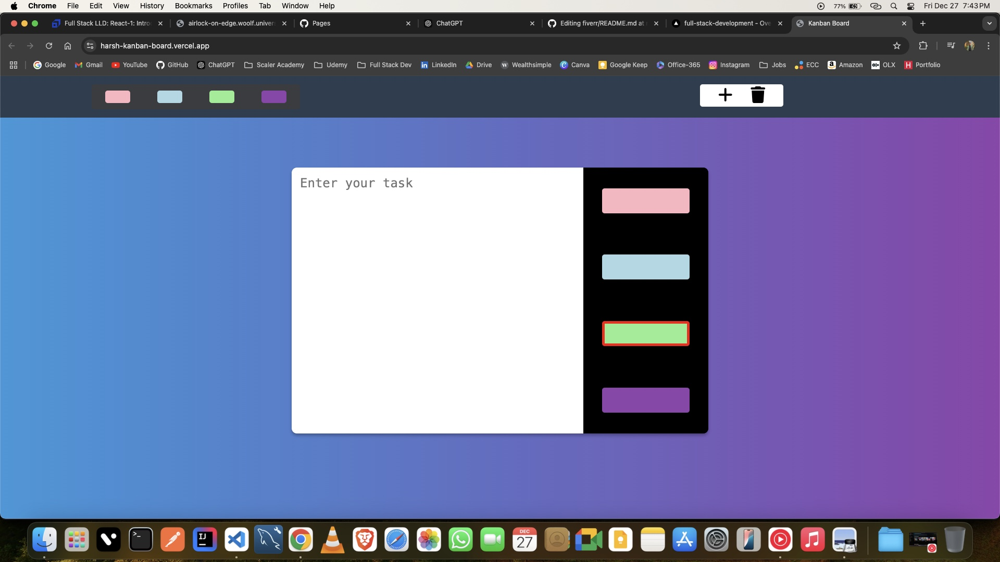

# Kanban Board

A simple and interactive Kanban Board built using HTML, CSS, and JavaScript.

## Live Demo

Check out the live demo of this website [here](https://harsh-kanban-board.vercel.app/).



## Features

- **Create Tickets**: Add new tickets with a unique ID, task description, and priority color.
- **Priority Filtering**: Filter tickets by priority color using the toolbox.
- **Change Priority**: Dynamically update the priority color of a ticket.
- **Lock/Unlock Tickets**: Toggle between locked (non-editable) and unlocked (editable) states for tickets.
- **Delete Tickets**: Enable delete mode to remove specific tickets.
- **Persistent Storage**: Save and load tickets from `localStorage` to ensure data persistence across browser sessions.

## Description

- Engineered an interactive Kanban board application using HTML, CSS, and JavaScript, enabling users to visually organize, create, and manage tasks with features like priority colors, task editing, and data persistence via localStorage.
- Developed an intuitive UI for seamless task management, ensuring an engaging user experience.
- Implemented persistent data storage to retain user tasks across sessions, enhancing usability and improving efficiency.
- Integrated color-coding to indicate task priority, with user controls for task modifications and edit locks to prevent unauthorized changes.

## Usage

### 1. Add Tickets

1. Click the "Add" button.
2. Enter a task description in the modal text area.
3. Press `Enter` to save the ticket or `Escape` to cancel.

### 2. Filter Tickets by Priority

1. Click on a priority color in the toolbox.
2. Double-click the toolbox to reset and view all tickets.

### 3. Edit Ticket Priority

1. Click on the priority color block of a ticket to cycle through available colors.

### 4. Lock/Unlock Tickets

1. Click the lock icon on a ticket to toggle between editable and non-editable modes.
2. Changes made to editable tickets are saved automatically.

### 5. Delete Tickets

1. Click the "Delete" button to enable delete mode.
2. Click on a ticket to remove it.
3. Toggle the "Delete" button again to exit delete mode.

## Installation

1. Clone or download the repository.
2. Open the `index.html` file in your browser.

## Project Structure

```
├── index.html      # Main HTML structure
├── style.css       # Styling for the Kanban board
├── script.js       # JavaScript for functionality
└── README.md       # Project documentation
```

## LocalStorage Integration

Tickets are saved to `localStorage` in JSON format. Each ticket includes the following properties:

- `id`: A unique identifier.
- `color`: The priority color of the ticket.
- `text`: The description of the task.

## Dependencies

- [Nanoid](https://github.com/ai/nanoid): Used to generate unique IDs for tickets.

## Future Enhancements

- Drag-and-drop functionality for ticket organization.
- Multiple boards or columns for better task segmentation.
- Export and import tickets as JSON files.
